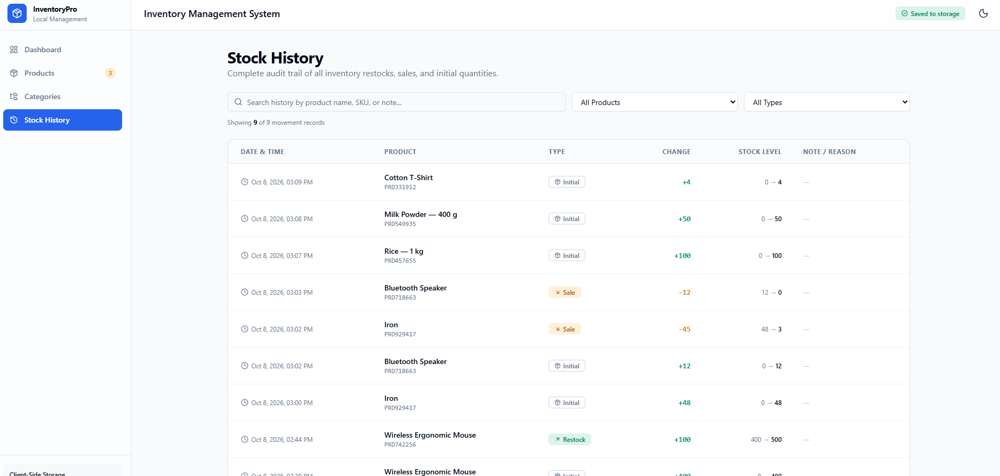
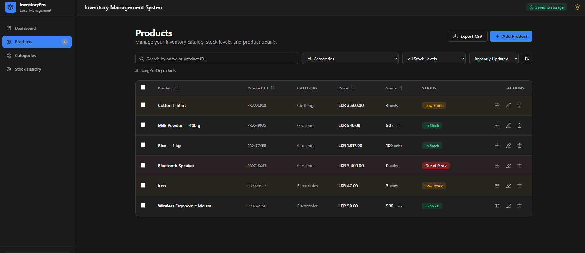
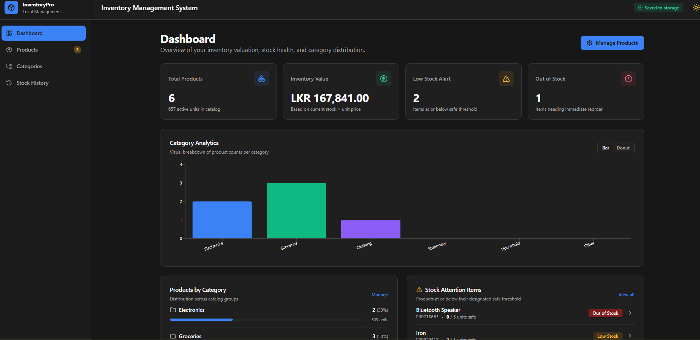
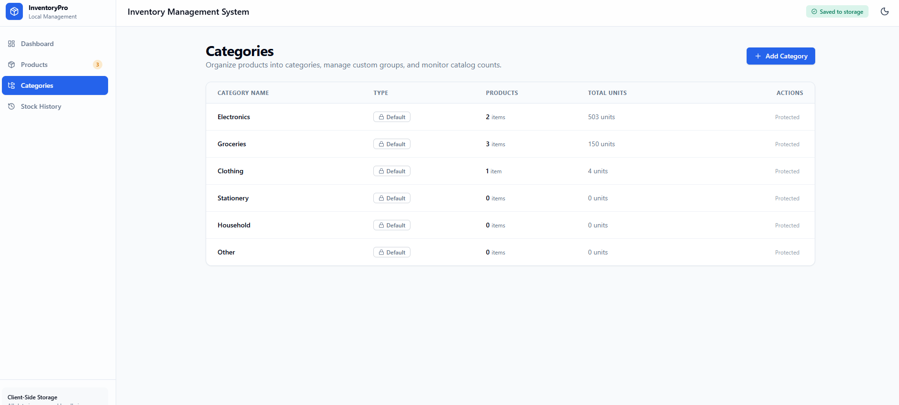
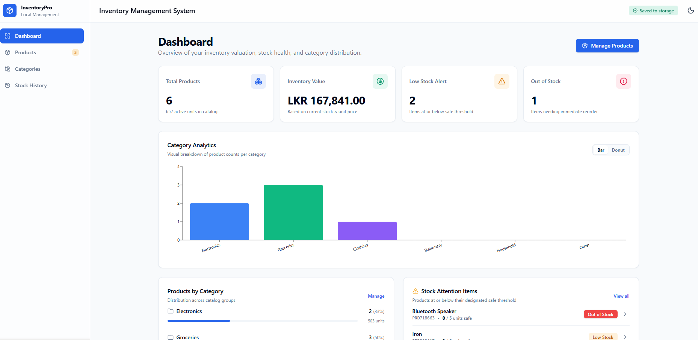

# Inventory Management System

InventoryPro is a frontend-only inventory management application for tracking products, categories, stock levels, and inventory statistics. It does not use a backend or database. All inventory data and the selected theme are saved in the browser with `localStorage`.

## Project overview

The application helps a user manage an inventory catalogue from one place. Users can add products, assign categories, update incoming or outgoing stock safely, and view stock health and inventory value on a dashboard. The interface is responsive for mobile and desktop screens.

## Features implemented

### Required features

- Add products with a product name, product ID, category, price, stock quantity, and low-stock threshold.
- Edit a product's name, category, price, and low-stock threshold.
- Delete one product with a confirmation dialog and an Undo action.
- Increase stock for incoming deliveries and decrease stock for outgoing sales.
- Prevent stock from going below zero.
- Show the total number of products, total units, total inventory value in LKR, low-stock count, and out-of-stock count.
- Create and rename custom categories.
- Assign a category to every product.
- Protect default categories and block deletion of a category that is still assigned to products.
- Filter products by category and stock status.
- Search products by name or product ID/SKU.
- Sort products by name, product ID, price, or stock quantity.
- Show category product counts, category stock totals, and stock-health information on the dashboard.
- Use a desktop product table and mobile product cards.
- Use Formik and Yup for every product, category, stock-adjustment, and bulk-restock form.
- Show clear validation messages for invalid or incomplete form values.
- Persist products, categories, history, and theme preferences through `localStorage`.

### Bonus and extra features

- **Auto-generated SKU:** Generates collision-checked IDs in the `PRD######` format.
- **Stock history log:** Records initial stock, restocks, and sales with timestamps, previous stock, resulting stock, and optional notes.
- **CSV export:** Downloads the full product catalogue as a CSV file. Exported values are protected against spreadsheet formula injection.
- **Dark mode:** Light and dark theme toggle saved in `localStorage`. The dark theme uses a neutral `#171717` background.
- **Category analytics:** Switchable bar chart and donut chart for category distribution.
- **Bulk actions:** Select several products, restock them with one validated form, or delete them together with Undo.
- **Low-stock warnings:** Product status badges and a dashboard attention list identify low and out-of-stock products.
- **Debounced search:** Waits briefly while typing to avoid unnecessary filter work.
- **Responsive interface:** Mobile navigation, stacked actions and forms, scrollable dialogs, and card layouts for small screens.

## Main pages

| Page          | Purpose                                                                                     |
| ------------- | ------------------------------------------------------------------------------------------- |
| Dashboard     | Shows inventory statistics, category analytics, category totals, and stock attention items. |
| Products      | Adds, edits, deletes, searches, filters, sorts, exports, and bulk-manages products.         |
| Categories    | Creates, renames, reviews, and safely deletes custom categories.                            |
| Stock History | Shows and filters the audit trail for initial stock, restocks, and sales.                   |

## Tech stack

| Area                  | Technology                                                 |
| --------------------- | ---------------------------------------------------------- |
| Framework             | React 19, TypeScript, Vite 8                               |
| Routing               | React Router 7                                             |
| Forms and validation  | Formik and Yup                                             |
| Styling               | Tailwind CSS, class-variance-authority, Lucide React icons |
| State and persistence | React Context, `useReducer`, browser `localStorage`        |
| Charts and feedback   | Recharts and Sonner                                        |
| Testing               | Vitest, jsdom, React Testing Library                       |
| Code quality          | ESLint, Prettier, Husky, lint-staged, Commitlint           |

## Run locally

### Prerequisites

- Node.js `20.19+` or `22.12+`
- npm

### Installation

```bash
git clone https://github.com/Methexx/Inventory-management-system.git
cd Inventory-management-system
npm install
```

### Start the application

```bash
npm run dev
```

Open [http://127.0.0.1:3000](http://127.0.0.1:3000) in your browser.

### Create a production build

```bash
npm run build
```

## Available scripts

| Command                | Purpose                                                 |
| ---------------------- | ------------------------------------------------------- |
| `npm run dev`          | Starts the Vite development server on `127.0.0.1:3000`. |
| `npm run build`        | Type-checks and creates an optimized production build.  |
| `npm run lint`         | Checks code with ESLint.                                |
| `npm run typecheck`    | Checks TypeScript types.                                |
| `npm run format`       | Formats files with Prettier.                            |
| `npm run format:check` | Checks Prettier formatting without changing files.      |
| `npm run test`         | Starts Vitest in watch mode.                            |
| `npm run test:run`     | Runs the full automated test suite once.                |
| `npm run preview`      | Serves the production build locally.                    |

## Code quality workflow

- **Prettier** keeps formatting consistent across TypeScript, CSS, Markdown, and configuration files.
- **ESLint** checks code quality and React-specific rules.
- **Husky pre-commit hook** runs lint-staged, which formats and lints changed staged files before a commit is created.
- **Husky pre-push hook** runs linting, type checking, tests, and the production build before a push can proceed.
- **Commitlint** accepts only the repository's `feat`, `fix`, and `chore` commit types and blocks co-author trailers.
- The automated suite currently contains **165 tests** covering services, schemas, reducer state, storage behaviour, utilities, and key form/dialog interactions.

## Project structure

```text
src/
├── components/   # Shared UI, layout, dialogs, and feedback components
├── constants/    # Limits, storage keys, and default categories
├── features/     # Product, category, stock, and dashboard feature components
├── hooks/        # Theme and debounce hooks
├── lib/          # Storage, CSV, ID, formatting, and result utilities
├── pages/        # Route-level pages
├── schemas/      # Yup validation schema factories
├── services/     # Pure product, stock, and category business rules
├── state/        # Reducer, selectors, context provider, and actions
└── types/        # TypeScript domain types
```

## Screenshots

### Dashboard — light mode



### Dashboard — dark mode



### Products — dark mode



### Categories — light mode



### Stock history — light mode



## Data storage

All data remains in the current browser. Clearing this site's browser storage removes locally saved products, categories, history, and theme preferences.
